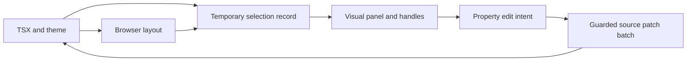

# Visual properties over live source

Research date: 2026-09-05. Source inspection at `9b978fa`, with the working tree as supplied. This is a design and implementation recommendation grounded in source and first-party documentation. No prototype performance or usability measurements were made for this report.

**Start with the [combined working prototype](http://127.0.0.1:7769/play/spool?frame=properties-combined).** Compare the [compact inspector](http://127.0.0.1:7769/play/spool?frame=visual-inspector), [contextual panel](http://127.0.0.1:7769/play/spool?frame=visual-context), [persistent handles](http://127.0.0.1:7769/play/spool?frame=gesture-inset), and [focused handles](http://127.0.0.1:7769/play/spool?frame=gesture-context). The [browser-layout lab](http://127.0.0.1:7769/play/spool?frame=mapping-cases) makes four mapping problems tangible. These are local Spool frames; their edits reset on reload.

Spool should present visual properties and direct spacing gestures, backed by a temporary interpretation of the selected element. Keep source code authoritative and the browser responsible for layout. The temporary model should connect a property to its editable source, active conditions, and observed result. It does not need to become a second persistent document.

The strongest initial surface is **layout direction, alignment, width/height behavior, padding, gap, typography, fill, border, and radius**. The implementation already contains much of the writing machinery. The work is to make the reading contextual and the interaction truthful, rather than exposing one row per utility family. Exact names and control arrangement remain a prototype decision for Liam.

## What exists, and what is missing

| Existing mechanism | Evidence | Consequence for this work |
| --- | --- | --- |
| A property-row inventory separates UI controls from class writes. It covers lengths, words, colors, radius, gradients, and size modes. | [properties-rows.ts:48](/Users/liamvinberg/projects/spool/src/ui/canvas/properties-rows.ts:48) | Preserve the write rules behind a smaller visual surface. A new persistent node tree is unnecessary for a better panel. |
| Class writes fold padding sides, preserve logical spellings, isolate variant scopes, and retain unrelated source text. | [class-write.ts:1](/Users/liamvinberg/projects/spool/src/daemon/class-write.ts:1), [class-write.test.ts:40](/Users/liamvinberg/projects/spool/src/daemon/class-write.test.ts:40) | One padding control can generate several operations without making the user manage class strings. |
| Multiple class changes to one element form one planned patch, with all-or-nothing planning. | [hand-write.ts:225](/Users/liamvinberg/projects/spool/src/daemon/hand-write.ts:225) | A paired padding drag or sizing-mode transition can be one undo step. |
| Resize reads source eligibility, writes width/height at base scope, and checks the reloaded size against the intended size. | [hand-resize.ts:74](/Users/liamvinberg/projects/spool/src/ui/canvas/hand-resize.ts:74), [hand-resize.ts:172](/Users/liamvinberg/projects/spool/src/ui/canvas/hand-resize.ts:172), [hand-resize.ts:186](/Users/liamvinberg/projects/spool/src/ui/canvas/hand-resize.ts:186), [canvas.tsx:2888](/Users/liamvinberg/projects/spool/src/ui/canvas/canvas.tsx:2888) | Keep the check after source application. Broaden eligibility using browser context rather than pretending source readability guarantees geometric control. |
| Spacing measurement already reads browser rectangles, margins, parent gaps, text direction, local `--spacing`, and root font size. | [document.ts:1022](/Users/liamvinberg/projects/spool/src/daemon/document.ts:1022), [document.ts:1091](/Users/liamvinberg/projects/spool/src/daemon/document.ts:1091), [protocol.ts:464](/Users/liamvinberg/projects/spool/src/ui/canvas/protocol.ts:464) | Extend a proven observation channel with padding, borders, writing mode, sizing constraints, and parent layout. Do not duplicate it with a speculative layout engine. |
| Theme menus use compiled project tokens; spacing fields have a project step, with a four-pixel fallback. Some rem conversion still assumes 16px. | [properties-theme.ts:32](/Users/liamvinberg/projects/spool/src/ui/canvas/properties-theme.ts:32), [properties-theme.ts:54](/Users/liamvinberg/projects/spool/src/ui/canvas/properties-theme.ts:54) | Use the selected document's resolved values for gestures. The existing runtime spacing reader already shows the stronger approach. |
| In-place text and deletion already have source operations and lifecycle state. | [hand-edit.ts:44](/Users/liamvinberg/projects/spool/src/ui/canvas/hand-edit.ts:44), [protocol.ts:533](/Users/liamvinberg/projects/spool/src/ui/canvas/protocol.ts:533), [hand-write.ts:474](/Users/liamvinberg/projects/spool/src/daemon/hand-write.ts:474) | Include them in the same selection experience; do not build a separate text document model merely to support literal labels. |

The current size-mode reading is particularly provisional. It calls absent width a Hug, treats `flex-1` as height Fill regardless of the parent, and groups viewport size with container Fill. Selecting Hug removes the axis utility; selecting Fill writes `*-full`. These are literal transformations, not a general account of layout. The nearest tests assert those transformations, so their existence does not validate the abstraction against browser behavior. [properties-families.ts:1005](/Users/liamvinberg/projects/spool/src/ui/canvas/properties-families.ts:1005), [properties-rows.ts:658](/Users/liamvinberg/projects/spool/src/ui/canvas/properties-rows.ts:658), [properties-rows.test.ts:238](/Users/liamvinberg/projects/spool/src/ui/canvas/properties-rows.test.ts:238)

## Four things the panel must keep distinct

1. **Source spelling:** `px-4 md:px-6`, `w-full`, a literal JSX label, or an expression. This is what a patch changes.
2. **Property and behavior:** inline padding bound to a spacing value; fixed preferred width; flexible growth; text that wraps. This is what the designer intends to change.
3. **Resolved style and used geometry:** the current padding lengths, actual rectangle, rendered font, and layout constraints at this viewport and state.
4. **Browser layout:** the algorithm that combines all children, available space, intrinsic content, fonts, cascade, and constraints into those pixels.

`getComputedStyle()` exposes resolved values, which can be computed or used values depending on the property. It does not return the original declaration, token binding, or a reliable source-edit target. `getBoundingClientRect()` returns geometry derived from the element's client rectangles; it is not the original CSS width and includes transform effects. These channels answer different questions. [CSSOM resolved values](https://drafts.csswg.org/cssom/#resolved-values), [CSSOM View geometry](https://drafts.csswg.org/cssom-view/#dom-element-getboundingclientrect)

A useful field can therefore say **Padding 24 · space-6**, with source scope available beside the controls, while retaining separate authored and observed values internally. If a width was authored as 240 but the browser used 180, the field must not silently rewrite its source to 180 or claim the intended change succeeded. The model can report a constraint without solving the whole cascade itself.

## Figma is useful vocabulary, not a CSS equivalence table

Modern Figma auto layout includes horizontal, vertical, and grid flows. The general guide documents Hug, Fill, Fixed, min/max sizing, and separate padding and gap controls. Manual resizing changes the affected sizing mode to Fixed, with a documented exception when a child is resized to its parent's available extent and becomes Fill. The guide also documents a parent Hug/child Fill dependency that forces a mode change. These are rules of Figma's own model, not facts inferred from a rectangle. [Figma auto layout guide](https://help.figma.com/hc/en-us/articles/360040451373-Explore-auto-layout-properties)

Figma's grid flow has track sizes, row/column gaps, spans, and automatic or manually controlled placement. Its current help describes Fill on nested objects and tracks. Calling Figma “just flexbox” is consequently outdated. This documentation is evidence of available concepts, not proof that its grid algorithm matches CSS Grid in every intrinsic-sizing case. [Figma grid flow](https://help.figma.com/hc/en-us/articles/31289469907863-Use-the-grid-auto-layout-flow)

Even Figma's API defines `layoutSizingHorizontal` as a shorthand for multiple underlying properties, including growth, alignment, and axis sizing. Applicability depends on whether the object is an auto-layout frame, child, or text node. That is the right precedent: a friendly sizing choice can be a contextual operation. It need not pretend to be a universal single declaration. [Figma sizing API](https://developers.figma.com/docs/plugins/api/properties/nodes-layoutsizinghorizontal/)

The following is a proposed Spool mapping, not a claim of exact Figma equivalence:

| Visual intent | CSS interpretation | Possible Tailwind source | Required context or caveat |
| --- | --- | --- | --- |
| Row / Column | Flex container and direction | `flex flex-row`, `flex flex-col` | Changes the selected container; may also change how child sizing behaves. Existing Grid or normal flow must remain identifiable. |
| Wrap | Flex line wrapping | `flex-wrap` | Affects line formation; row gaps and alignment between lines become relevant. |
| Align children | Main-axis distribution plus cross-axis alignment | `justify-*`, `items-*` | A physical nine-position control must translate through direction and writing mode. Baseline and distribution are extra modes. |
| Padding | Internal spacing between content and border | `p-*`, `px-*`, `py-*`, side utilities | Keep authored side relationships and token binding. Distinguish physical sides from logical axes. |
| Gap | Explicit gutters between children or tracks | `gap-*`, `gap-x-*`, `gap-y-*` | Owned by the container. Measured separation may also contain margins or distributed free space. |
| Content-sized / Hug | Intrinsic or automatic sizing appropriate to this layout | Sometimes `w-fit`, `w-max`, `h-auto`, or removal | `fit-content`, `max-content`, and `auto` differ. Offer only a justified recipe; otherwise show Auto/Custom. |
| Fill available space | Growth, stretch, or percentage sizing according to parent layout | Sometimes `flex-1`, `grow`, `self-stretch`, `w-full` | Main axis and cross axis differ. Siblings, basis, min-size and parent definiteness matter. |
| Fixed size | Explicit preferred size, with a chosen flex policy | `w-*`, `h-*`; possibly `shrink-0` or basis changes | A CSS width alone does not guarantee an invariant rendered width. Never silently delete constraints to make it match. |
| Minimum / Maximum | Bounds on the chosen sizing behavior | `min-w-*`, `max-w-*`, height equivalents | Keep visible when they explain why a drag stops. |
| Fill / Text color / Radius | Paint or border-radius property | `bg-*`, `text-*`, `rounded-*` | Choosing a named theme value and editing its global definition are different operations. |
| Font / Size / Line height | Typography declarations and optional token bundles | `font-*`, `text-*`, `leading-*` | A font-size token can also encode line height. Preserve coupled values unless the user explicitly separates them. |
| Text / Delete | Literal content or JSX structure edit | JSX text replacement or child removal | Source ownership is operation-specific. A visible repeated instance is not necessarily independently editable. |

Tailwind's docs support direct padding utilities, arbitrary lengths and variable references; numeric padding uses the project's `--spacing`. Its `px-*` and `py-*` compile to logical inline/block padding, while physical and logical side utilities coexist. Tailwind also distinguishes flexible sizing presets such as `flex-auto`, `flex-initial`, and `flex-none`. These spellings are an implementation vocabulary, not enough information to infer a design intention. [Tailwind padding](https://tailwindcss.com/docs/padding), [Tailwind flex](https://tailwindcss.com/docs/flex)

## Counterexamples that the new reading must survive

**An ordinary block with no width utility.** A normal-flow block's auto width uses available space after margins, borders, and padding. The current reader calls it Hug because the class family is absent. Conversely, removing `w-full` does not necessarily make that block shrink around its text. [CSS block width calculation](https://www.w3.org/TR/CSS2/visudet.html#blockwidth)

**Two children in a horizontal flex row.** Making one child `w-full` requests a percentage width; it does not directly mean “take only the room left after the sibling.” Flex basis, growth, shrinkage, and automatic minimum size determine the eventual result. `flex-1` acts along the parent's main axis, so the current height-only special case fails for a row. A fixed width can also shrink unless the surrounding flex policy prevents it. [CSS Flexbox sizing](https://drafts.csswg.org/css-flexbox-1/#flexibility)

**A 200px box with 20px padding on each side.** Under content-box sizing its border box includes padding in addition to the stated width; under border-box sizing padding consumes part of the stated width. Dragging the exterior is consequently not equivalent to setting its observed width as the CSS width. Intrinsic keywords also distinguish maximum content extent from fitting within available space. [CSS sizing and box edges](https://drafts.csswg.org/css-sizing-3/#box-sizing)

**A 60px visible interval in a row using distributed alignment.** The entire interval cannot be attributed to `gap`. Distributed alignment and margins can enlarge the visible distance beyond the explicit gutter. A gap handle must target the container's gap value and visually show any other contribution separately. [CSS gutters](https://www.w3.org/TR/css-align-3/#gaps)

**A right-to-left component or vertical writing mode.** Inline-start is not always left, and inline is not always horizontal. The current property folds hardcode logical start to left and end to right; the runtime measurement already has direction, but neither is a complete writing-mode model. Keep direction and writing mode in the selection reading and transform the handle's physical side into the authored logical side. [CSS logical mappings](https://www.w3.org/TR/css-logical-1/#box), [properties-families.ts:400](/Users/liamvinberg/projects/spool/src/ui/canvas/properties-families.ts:400)

**A base field under `md:px-8`, or a custom container query.** Choosing which condition to edit and choosing which viewport to observe are distinct. Tailwind supports breakpoint ranges, customized breakpoints, and container-query variants. An active condition is not reliably reconstructed from a handful of fixed prefix names. [Tailwind responsive design](https://tailwindcss.com/docs/responsive-design)

Current scope parsing accepts only simple colon-delimited words, and resize always writes base. `screenConflict` recognizes a fixed screen-name set and conservatively refuses a matching base-family write without checking whether that screen condition currently applies. A visual editor must preserve this limitation honestly until its scope reader and writer support more. [class-write.ts:95](/Users/liamvinberg/projects/spool/src/daemon/class-write.ts:95), [hand-resize.ts:172](/Users/liamvinberg/projects/spool/src/ui/canvas/hand-resize.ts:172)

## Temporary edit nodes

Use a temporary **selection record** with these four groups of facts:

- **Identity:** current frame/document revision, occurrence selector, source stamp, source fingerprint, and source target for each operation.
- **Observation:** border/content geometry, resolved padding/borders/gaps, root font size and local variables, direction/writing mode, own display and parent layout, sizing constraints, transform state.
- **Editable properties:** semantic property, authored value or binding, observed value, active edit condition, capability and refusal reason, planned source operations.
- **Gesture state:** initial observation, pointer origin, chosen side/axis, linked sides, snapping state, preview value, and pending commit identifier.

This is a proposal for the information boundary, not a requirement to store every computed property. Read the additional facts needed by the visible control or active gesture. Refresh after document reload, source revision, viewport change, font settlement, or relevant layout change. Selection loss or Escape discards an uncommitted draft.

It becomes a shadow document if it starts persisting alternate sizes, text, children, or component overrides that survive independently of the TSX, or if Spool starts running its own layout solver and treats that geometry as authoritative. A cache of observed nodes and a draft patch do neither. Chrome DevTools already separates matched declarations, computed properties, and editable temporary changes; that is useful architectural evidence for this separation, though it does not provide Spool's TSX write-back. [Chrome CSS reference](https://developer.chrome.com/docs/devtools/css/reference?hl=en)

During drag, preview the same property operations the commit will perform, and use the browser's resulting geometry for overlays. A synthetic ring alone cannot show a button's text reflow or siblings moving. An inline override can make a preview appear to work even when a utility will lose in the cascade; if used for immediate feedback, it remains provisional and must be reconciled with the compiled source result. Prefer a preview path preserving the eventual declaration's scope and precedence where practicable. This is an implementation requirement to investigate, not a claim that the existing preview already does it.

## Direct gestures and project-scale snapping

**Outer resize changes sizing. Inner padding handles change spacing. Gap handles change a container's gutter.** Let their visible affordances establish intent before the drag begins. An outer drag on a content-sized button should not secretly rewrite padding; a padding drag should preserve the current sizing behavior and let browser layout decide whether the outer box grows or the content area contracts.

The current resize code rounds to whole pixels. Its serializer emits a numeric utility when the resulting size is an exact whole theme step and an arbitrary pixel utility otherwise. It does **not** snap a 23px drag to 24px. A comment about rounding onto the scale should not be mistaken for an implemented snap policy. [hand-resize.ts:101](/Users/liamvinberg/projects/spool/src/ui/canvas/hand-resize.ts:101), [hand-resize.ts:160](/Users/liamvinberg/projects/spool/src/ui/canvas/hand-resize.ts:160), [hand-resize.test.ts:125](/Users/liamvinberg/projects/spool/src/ui/canvas/hand-resize.test.ts:125)

Recommended prototype policy:

1. Padding and gap drags prefer the project's spacing lattice. Resolve the actual `--spacing` and any explicitly configured named spacing values in the selected document. A project with a 5px step should produce 10, 15, 20, 25px stops, not a hardcoded 8/16/24 menu.
2. Use proximity snapping with visible ticks/readout, a stable release threshold, and a temporary free-drag modifier. Preserve an off-scale initial value until the pointer actually moves. Do not invent a snapping threshold from this research; test it at several zoom levels.
3. Keep exact typed values possible. Binding to a named project token should be explicit when multiple names resolve to the same pixels. A literal and a token with today's same value can behave differently after a theme change.
4. Treat exterior size separately: free pixel resizing with optional spacing and geometry snaps is a better initial comparison than forcing every width onto the padding lattice. A semantic Fill snap must be visibly different from matching a nearby pixel width.
5. Provide single-side, paired-side, and all-side control. Make the active linking visible; shortcuts supplement it. Do not allocate the same modifier to both linking and bypassing snap.

Tailwind's theme mechanism supports project-defined design tokens; it does not require a closed list such as `p-2`, `p-4`, `p-6`. Numeric utility availability is also not evidence that every numeric value is an intentional design-system stop. Therefore infer only the base lattice from the numeric step; use explicit project tokens for stronger named recommendations. [Tailwind theme variables](https://tailwindcss.com/docs/theme)

Webflow already documents draggable padding/margin controls, presets, exact values, alternate units, paired sides, and all sides. This establishes that direct spacing adjustment and typed control can coexist. Its documentation describes the Style panel controls; it should not be cited as evidence that Spool's proposed on-canvas inner handles have been validated. [Webflow spacing](https://help.webflow.com/hc/en-us/articles/33961243177875-Spacing-margin-and-padding)

Webstudio's style panel separately exposes layout, flex/grid child behavior, size, spacing, and typography. It indicates whether a value comes from the current source, another source/state/breakpoint, or a default. That is a particularly useful precedent for provenance and contextual child controls. Its local/token document ownership should not be imported into Spool as though arbitrary React instances already had local overrides. [Webstudio Style panel](https://docs.webstudio.is/university/foundations/style-panel)

## Source edits, text, and undo remain the boundary

The lane currently refuses expression class names, inline styles, and spreads without an owned literal. That is more restrictive than browser editability, but it prevents a visual control from overwriting runtime logic. The proposed selection record should expose capabilities per operation rather than promising that every selected rectangle is writable. Source fingerprints already protect against an agent changing the file after the read. [hand-write.ts:440](/Users/liamvinberg/projects/spool/src/daemon/hand-write.ts:440), [hand-lane.ts:112](/Users/liamvinberg/projects/spool/src/daemon/hand-lane.ts:112)

Text editing can keep the existing in-place behavior. The source planner accepts the element's literal words, preserves surrounding layout whitespace, and refuses expression children, nested markup, and mapped text. Deletion requires a whole JSX child and removes its source span. Retain these boundaries until an explicit source-provenance feature supports more. In particular, editing one rendered data row must not silently replace a data expression with a literal. [hand-write.ts:474](/Users/liamvinberg/projects/spool/src/daemon/hand-write.ts:474), [hand-write.ts:509](/Users/liamvinberg/projects/spool/src/daemon/hand-write.ts:509)

A gesture lifecycle should be: read and gate; preview one semantic intention; commit the minimal source operation batch; recompile; reread; reconcile; retain one undo entry. If source or document identity changed, refresh before retrying. If the resulting property cannot realize the chosen intention, show the reason and use the existing guarded rollback path. Do not add `!important`, absolute positioning, or constraint removal as an automatic repair.

For text, focus ownership must distinguish editing characters from deleting the selected element. Escape cancels the draft; the eventual submit/click-away policy should follow the existing text interaction unless the prototype demonstrates a clearer one. React cautions that content-editable children require manual management; a temporary edit island must hand rendering ownership back cleanly when the session ends. [React common DOM props](https://react.dev/reference/react-dom/components/common#caveats)

## Recommendation and remaining tests

Build the visual controls over a contextual selection record, while reusing the existing source planner, theme reader, operation batch, and undo machinery. First compare a real button/card flow with padding handles, a gap handle, a compact visual property panel, literal text editing, and deletion. The proposed sizing model should keep an honest Auto/Custom state where Hug/Fill/Fixed cannot be justified. It should not force every CSS case into three labels.

The unresolved engineering work is source attribution beyond literals; condition-aware preview and writes; parent-aware sizing recipes; correct box and transform measurement; and reconciliation latency. The unresolved interaction work is handle discoverability, linking defaults, snapping thresholds, and whether a mode-changing resize is legible. None is settled by the cited documentation.

Useful later validation cases are: block auto width; horizontal and vertical flex children; intrinsic minimum content; border-box and content-box; min/max clamps; scoped padding; customized spacing and root font size; RTL and vertical text; wrapped flex/grid gaps; transformed elements; inline text composition and cancellation; source edits arriving during a gesture; and undo after a batch. The research stage inspected the local tests; the subsequent checks are recorded below. Production code and GitHub issues were not changed.

## What the parallel prototypes established

Three GPT-6 Astra investigations covered semantic mapping, two visual panels, and two gesture approaches. The combined take then brought the panel and canvas controls onto one source-string model. A separate browser lab tests the interpretation problem without hiding it behind editor controls. This is prototype correctness work, not a user study or a production performance result.

| Take | What to try | Assessment |
| --- | --- | --- |
| `visual-inspector` | Select the card, use the nine-position alignment grid, change direction, width behavior, paired padding, fill, and radius. Select a heading for typography. | Closest to the familiar Figma interaction. A few stable sections suit repeated edits. My preferred foundation for the properties rail. |
| `visual-context` | Open one summary such as Layout or Spacing; edit; return to the summaries. | The quietest resting state. It adds navigation between related edits, so I would retain this as an alternative rather than declare it universally better. |
| `gesture-inset` | Drag the four interior bars, explicit gap handle, or outside width square. Scrub the box diagram in the rail. | Most discoverable. The persistent shading makes the selected element visually busy. Useful as an onboarding or inspection comparison. |
| `gesture-context` | Move between a canvas side and the matching rail value. Drag, cancel, undo, and change the project-unit fixture. | Better focus. Only the relevant space is shaded, while its numeric control remains available. |
| `properties-combined` | Use the visual inspector and direct handles together; inspect source only when needed. | Recommended direction. It keeps the alignment grid and property vocabulary, reveals spacing highlights while interacting, and uses one edit model for both surfaces. |
| `mapping-cases` | Switch Auto/Content; switch flex direction and filling policy; toggle box sizing; compare gap with distributed spacing. | An explanation and falsification tool, separate from the proposed app UI. It shows why observed pixels need layout context. |

These comparisons revise the earlier [utility-list recommendation](shared-library-second-pass.md). The visual controls deserve to be the primary interface. Utility spellings remain valuable as a source explanation and an exact-value escape hatch. Their presence does not require a permanent list of every class on the element.

### The editing interaction I would pursue

Keep three stable groups for a selected container: Size, Layout, and Appearance. Typography appears for text-bearing selections. Put direction, the alignment grid, gap, and padding together because they jointly determine the composition. Individual padding sides should appear when values differ or when explicitly opened. A one-sided canvas drag must not leave a paired field implying both sides changed.

Select an element once. The outline offers an outside size handle and small inside spacing handles. Highlight the relevant space when approached or dragged; retain a plain selected outline at rest. Double-click literal text to edit it. Delete removes the selected source element within the supported source boundary. The property panel and gestures share the same transaction and undo behavior.

Changing a numeric field accepts the exact typed value. Spacing drags use the project lattice by default, with Alt allowing an exact value. The prototypes compare 4px and 6px base units: `p-6` therefore resolves to 24px or 36px. A 33px exact inset under the 4px fixture produces `pt-[33px]`; a 36px inset produces `pt-9`. Nothing in Tailwind requires skipping straight from `p-2` to `p-4` to `p-6`. A more selective set of preferred stops is a separate design-system choice.

Exterior width stays free in this comparison. A 37px drag from 400px produces a 437px preferred width and retains the padding. This keeps the gesture's intent predictable. Snapping to other geometry, choosing Fill, and binding a named width token should later have their own visible behavior.

The temporary model is useful precisely because the browser and source answer different questions:

Keep the persistent model as TSX and the theme. A selected element can temporarily have an identity, source bindings, resolved values, parent context, capabilities, and a gesture draft. Building an editor-owned layout engine or saving alternate component trees would substantially increase the commitment and the synchronization burden. The research does not establish a need for either.

### Prototype boundaries

The five editor takes share a deliberately bounded model in `design/shared/lib/explore/properties-map/model.ts`. It stores fixture class strings, literal text, and deletion in memory. Its scene interprets the supported classes into inline preview styles and lets real browser layout arrange the children. It does **not** run arbitrary edited classes through Tailwind or use the daemon's source writer. The existing source tests and the prototype browser checks therefore establish different things.

The 4/6 spacing selector is an experiment fixture. It proves that the interaction can operate on a supplied scale; it does not implement theme discovery, token provenance, named-token binding, custom root-font conversion, or semantic token editing. Hover is an explicit simulated preview of one supported variant, not a complete responsive/cascade engine. Snapping currently rounds to the nearest base multiple; proximity thresholds and hysteresis remain to test.

The editor fixture uses horizontal, left-to-right writing, border-box sizing, and known parent relationships. Its Content/Fill choices are recipes for those relationships. It does not establish universal Hug/Fill/Fixed semantics. The lab intentionally exhibits cases the fixture does not model. Grid editing, margins, border editors, min/max constraints, multiline text composition, simultaneous source edits, and arbitrary component attribution remain outside these prototypes.

Button/card/heading are source fixtures in one application example. There is no synthetic shared-use count. A future shared preview needs real source attribution and several real occurrences before it can truthfully promise that a field edits all of them.

### What this means for #29–32

I would keep the product direction and reduce the commitment of its first implementation. The initial capability should be trustworthy visual editing of existing source, including shared source where its ownership is known. The shared library can then expose those same definitions and authored examples through the same controls.

| Ticket | Recommendation after this pass |
| --- | --- |
| [#29](https://github.com/liamvinberg/spool-cloud/issues/29) | Keep shared editing as the core capability. Its foundation should include operation-specific source ownership and the contextual selection reading needed by visual controls. |
| [#30](https://github.com/liamvinberg/spool-cloud/issues/30) | Keep selection-triggered identity and reach signals. Their meaning should follow the actual edit target; avoid claiming every property, label, and deletion has identical shared scope. |
| [#31](https://github.com/liamvinberg/spool-cloud/issues/31) | Begin with authored component examples using ordinary frames. Defer mandatory generation of one frame per export and automatic first-use crops until those solve demonstrated navigation problems. |
| [#32](https://github.com/liamvinberg/spool-cloud/issues/32) | Keep contextual travel to a known definition/example and a clear return path. Let the library destination earn a permanent place after the content and edit model work. |

If “build the library first” means a small internal library of visual controls and semantic property operations, yes: that gives the UI and gestures a common foundation. If it means building a full component catalog and a new persistent node schema before editing a button feels right, the evidence supports a smaller first step.

No ticket was rewritten or reopened in this pass. The prototype is the reviewable decision material. A production plan should follow the chosen visual direction, then separately address the contextual-sizing and source-boundary cases above.

## Verification of this pass

- All six frames rendered and were visually inspected. The combined frame also loaded through the linked Spool player route. Browser checks reported no runtime errors.
- Headless pointer checks covered snapping, Alt exact values, Escape cancellation, one-gesture undo, outer width retaining padding, captured movement outside a handle, 75% zoom, panel/canvas agreement, horizontal and vertical gaps, and the 4/6 unit fixtures.
- Integration checks covered exact numeric entry, independent sides, hover-only source changes, switching back to base, measured size retained when becoming fixed, literal button/heading text editing, text cancellation, Delete, and restoring deletion with undo. Clicking an off-scale padding handle without dragging preserves the value.
- The tests exposed two interaction defects that were fixed: padding hit areas obstructed inline text on small buttons, and paired fields incorrectly summarized unequal sides after a one-sided drag. Hit areas now occupy padding space; the panel reveals individual sides when needed.
- The browser lab measured the documented fixture cases: auto block width 460px versus fit-content 123.9px; equal flex shares versus a 100% child exhausting its sibling's room; 220px authored width producing a 220px border box or a 272px content-box border rectangle; and a 16px explicit gap within a 110px distributed interval. These are measurements of these fixtures, not universal constants.
- Existing source checks passed: 89 tests across `hand-resize.test.ts`, `properties-rows.test.ts`, and `class-write.test.ts`; `pnpm typecheck`; and `pnpm check` (439 files). The design project check still reports 65 pre-existing diagnostics elsewhere, with zero in `properties-map`.

These checks support the feasibility and internal consistency of the exploration. They do not settle the preferred visual treatment or replace testing the production source writer against the full CSS and React cases described above.
